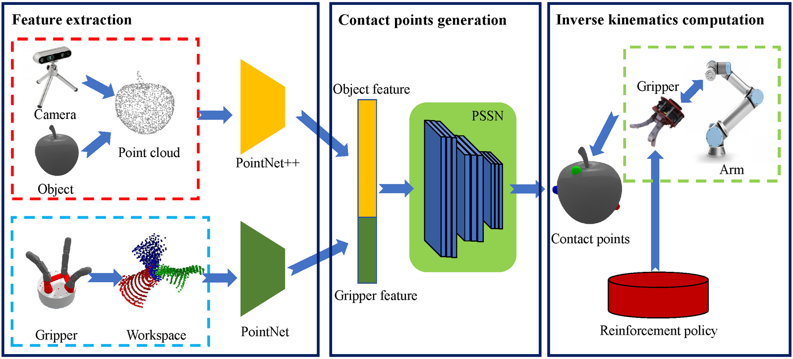
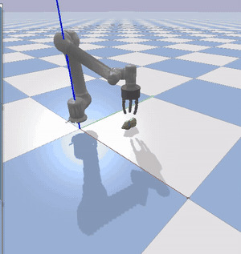
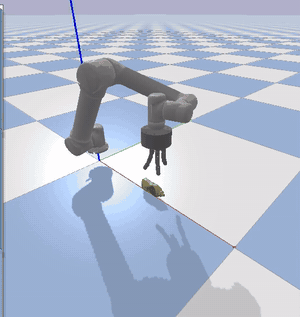
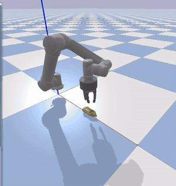
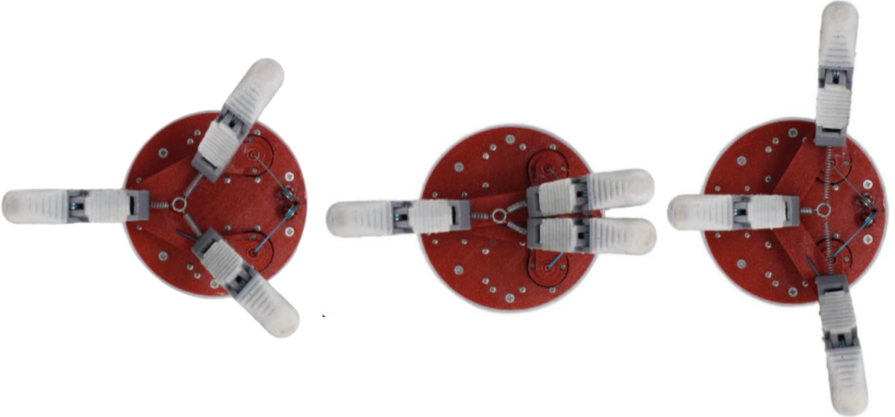
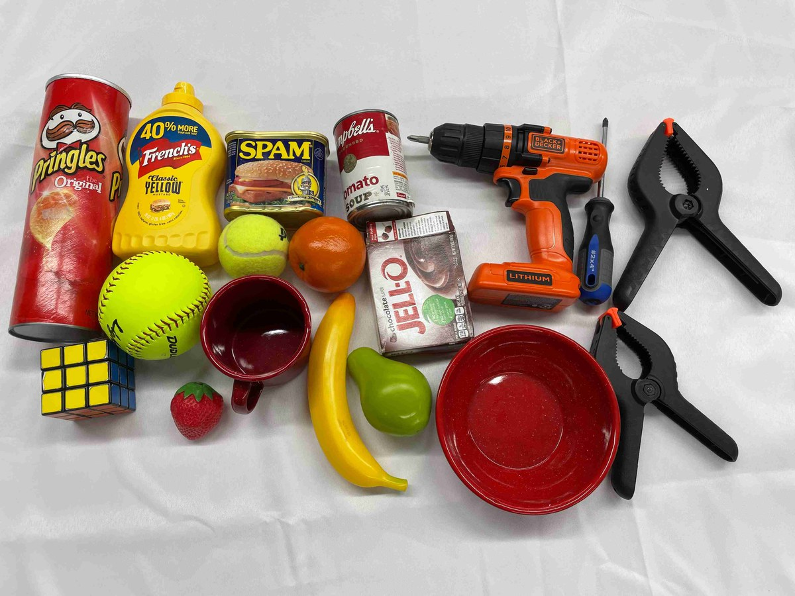
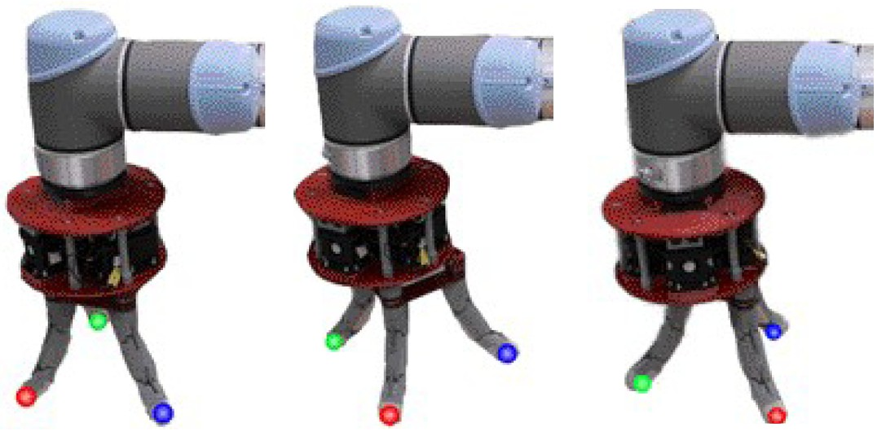
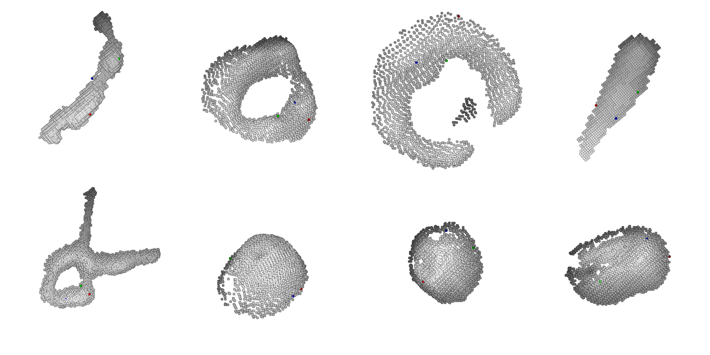

# EfficientGrasp: A Unified Data-Efficient Learning to Grasp Method for Multi-fingered Robot Hands

Code and data for the paper [*EfficientGrasp: A Unified Data-Efficient Learning to Grasp Method for Multi-fingered Robot Hands*](https://arxiv.org/abs/2206.15159) (Kelin Li, Nicholas Baron, Xian Zhang and Nicolas Rojas, IEEE Robotics and Automation Letters 2022, presented at IROS 2022).

The repository contains the three phases of the method: the fingertip-workspace autoencoder that produces the gripper feature, the point set selection network (PSSN) that selects contact points on an object point cloud, and the reinforcement-learning policies that solve the gripper inverse kinematics. It also contains the PyBullet grasping trials, the grasp quality computation and the processing scripts of the real-world experiments.

A gripper is described by the workspace of its fingertips instead of a URDF model, so the method also applies to grippers with closed kinematic loops such as the [RUTH hand](https://doi.org/10.1177/02783649211048929), which a URDF cannot represent. The workspace is encoded into a 256-d feature, concatenated with the [PointNet++](https://github.com/charlesq34/pointnet2) feature of the object point cloud, and fed to a PSSN derived from [UniGrasp](https://github.com/stanford-iprl-lab/UniGrasp). The arm then moves to a rest pose facing the selected contact points and a soft actor-critic policy drives the fingertips onto them. Three grippers are supported: the RUTH hand, the Robotiq 3-Finger gripper and the BarrettHand BH8-280, each mounted on a UR5.

<p align="center">
  
</p>

| Object orientation `pi00` | Object orientation `pi0pi` | Object orientation `pipipi` |
|:---:|:---:|:---:|
|  |  |  |

*UR5 with the RUTH hand grasping the YCB mustard bottle in PyBullet (3× speed).*

---

## 1. Hardware

Training and the simulation trials need only a PC. The robot, the hand and the camera are needed for the real-world experiments (§6).

| Component | Role | Notes |
|---|---|---|
| Linux PC with an NVIDIA GPU | Runs PyBullet and trains the autoencoder, the PSSN and the RL policies | The paper used an Intel Core i7-9700K with an RTX 2080 Ti for the PSSN and an RTX 3070 for the RL policies. `grasp_quality/utils/Losses.py` requires CUDA |
| UR5 robot arm | Carries the gripper | Simulated in PyBullet; the real arm is used in §6 |
| RUTH hand | Three-finger underactuated gripper with a five-bar reconfigurable palm (closed loop) | Simulated and real |
| Robotiq 3-Finger gripper, BarrettHand BH8-280 | Grippers without closed loops, used for the comparison with UniGrasp | Simulation only |
| Intel RealSense D435i | Depth image of the object, converted to a point cloud | Real-world experiments only |

<p align="center">
  
</p>

*The RUTH hand in three operation modes. The finger bases move with the five-bar palm, so the "most open" and "most closed" configurations that UniGrasp needs are ambiguous.*

<p align="center">
  
  &nbsp;
  
</p>

*Left: the YCB objects of the real-world experiments. Right: the RUTH hand on the UR5 moving from its initial configuration to the selected contact points (red, green, blue).*

---

## 2. Repository layout

The code is split by functional module. `contact_point_selection/UniGrasp/` is derived from [UniGrasp](https://github.com/stanford-iprl-lab/UniGrasp) and `grasp_quality/` from [diverse-and-stable-grasp](https://github.com/tengyu-liu/diverse-and-stable-grasp) (which vendors DeepSDF); both keep their own licences. Each gripper directory in `rl_inverse_kinematics/` ships its own copy of gym 0.14.0 with the custom environment.

```
environment.yml                        conda environment "RAL2023"
gripper_representation/
  feature_extraction/
    workspace_generator.py             fingertip workspaces of parametric three-finger grippers
    workspace.py                       RUTH fingertip workspace sampled in PyBullet
    encoder.py                         PointNet autoencoder with the coupled Chamfer distance
    encoder_test.py                    extracts the feature of a gripper with the trained encoder
  ruth_workspace_sampling/             RUTH workspace sampled through the gym environment
contact_point_selection/
  UniGrasp/
    point_set_selection/
      train_pssn.py                    staged PSSN training on the workspace feature
      unigrasp.py                      PSSN inference: point cloud in, contact points out
      pointnet4/                       PointNet++ and its TF operators (to be compiled)
    gripper_urdf/  simulation/  vis_3d/    unmodified UniGrasp
grasp_quality/
  utils/Losses.py                      force-closure estimator; its __main__ computes the GQS
rl_inverse_kinematics/
  ruth/  robotiq_3f/  barrett/         one self-contained directory per gripper
    train.py  val.py                   SAC training and validation
    sac.py  model.py  replay_memory.py
    demo.py  RL_gripper.py  move_ur.py full grasp pipeline in PyBullet
    gym/envs/kelin/                    environment kelin-v0, URDFs of UR5 + gripper
  early_prototype/                     first SAC version
  revision_lr_ablation/                learning-rate study and its plots
  her_baseline_attempt/                HER baseline, not connected to the environment
evaluation/
  simulation/   test.py  RL_eval.py    trial driver (16 YCB objects), RL-IK error plot
  real_world/                          point cloud processing, target pose, renders, occlusion analysis
media/readme/                          images used in this README
docs/file_reference.md                 per-file notes and provenance of every folder
```

`results/`, `third_party/` and all datasets, checkpoints and meshes are not in git; see §3.4.

---

## 3. Installation

### 3.1 Conda environment

```bash
conda env create -f environment.yml    # Python 3.6, PyTorch 1.10.1 (CUDA 11.3), PyBullet 3.2.1, Open3D 0.14.1
conda activate RAL2023
```

This environment covers `rl_inverse_kinematics/`, `evaluation/` and `grasp_quality/`. `train.py` logs to [visdom](https://github.com/fossasia/visdom) and uses `mpi4py`, both included.

### 3.2 TensorFlow (autoencoder and PSSN only)

`environment.yml` does not contain TensorFlow. The autoencoder (`encoder.py`) and the PSSN use the TensorFlow 1 API with `tflearn`, and the PSSN also needs `tensorflow.contrib.slim`, so a TensorFlow 1.x installation is required, preferably in a separate environment.

The PointNet++ operators have to be compiled once against that TensorFlow:

```bash
cd contact_point_selection/UniGrasp/point_set_selection/pointnet4/tf_ops
(cd sampling         && sh tf_sampling_compile.sh)
(cd grouping         && sh tf_grouping_compile.sh)
(cd 3d_interpolation && sh tf_interpolate_compile.sh)
```

### 3.3 gym

Do not rely on the `gym==0.21.0` listed in `environment.yml`. The environment `kelin-v0` is registered in the gym 0.14.0 copy inside each gripper directory, which is picked up when the scripts are started from that directory:

```bash
cd rl_inverse_kinematics/ruth     # or robotiq_3f / barrett
python -c "import gym; print(gym.__file__)"   # must point into this directory
```

### 3.4 Data and models

GitHub holds the code, the URDF/xacro files and a few figures and clips. Everything else is distributed separately on HuggingFace (link to be added) and has to be placed at the same paths, because the scripts expect the files there. `.gitignore` encodes this split, so the files are not staged by accident.

| Path (relative to the repository root) | Contents | Size |
|---|---|---|
| `gripper_representation/data/WorkspaceArrays/` | 44 751 fingertip-workspace arrays (autoencoder training set) | 3.8 GB |
| `gripper_representation/feature_extraction/{coupRotWorkspaceArrays,ruthArrays,saved_models,logs}/` | RUTH and coupled-rotation workspaces, trained autoencoder, TF logs | 175 MB |
| `contact_point_selection/UniGrasp/data/` | Object point clouds, PSSN contact points, gripper workspace features, UniGrasp labels | 470 MB |
| `contact_point_selection/UniGrasp/saved_models/` | PSSN checkpoints (`point_set_selection/220model.ckpt` is EfficientGrasp), released UniGrasp models | 1.3 GB |
| `contact_point_selection/UniGrasp/point_set_selection/logs/` | PSSN training TF events | 130 MB |
| `grasp_quality/data/`, `grasp_quality/utils/manopth/mano/models/` | DeepSDF weights and MANO models. MANO is licence-restricted: obtain it from [mano.is.tue.mpg.de](https://mano.is.tue.mpg.de) | 280 MB |
| `rl_inverse_kinematics/<gripper>/log/` | Trained SAC policies | 4.5 GB |
| `rl_inverse_kinematics/<gripper>/{contact_points,contact_list,ws1}.npy`, `obj_pc/` | RL training targets, object point clouds | 40 MB each |
| `rl_inverse_kinematics/*/gym/envs/kelin/**/meshes/`, `urdf/**/*.{stl,dae,obj}` | Gripper and UR5 meshes referenced by the URDFs | 350 MB |
| `third_party/` | [pybullet-object-models](https://github.com/eleramp/pybullet-object-models) (YCB meshes), three variants | 430 MB |
| `results/rl_ik_error/`, `results/pssn_accuracy/` | Evaluation logs behind Fig. 7, Table II and Fig. 6 of the paper | 1 MB |
| `results/videos/unigrasp_baseline/` | 128 grasp clips of the UniGrasp baseline | 97 MB |
| `evaluation/real_world/object_pointclouds/` | 17 RealSense captures, 2048 × 3 | 1 MB |

The PSSN is trained on the UniGrasp dataset, which is not redistributed here: download `train_data.tar.gz` and `test_data.tar.gz` from the links in `contact_point_selection/UniGrasp/README.md`.

`rl_inverse_kinematics/*/pybullet_object_models` are symbolic links into `third_party/`. They are broken until `third_party/` is in place. The three variants differ only in the mass, friction and inertia of the mustard bottle (`docs/file_reference.md`).

### 3.5 Paths

Unlike the data layout, the scripts have **not** been made relocatable. They still contain absolute paths of the machines they were written on, and the simulation driver imports the gripper packages under their old names. These have to be edited by hand before running:

| In the scripts | Replace with |
|---|---|
| `/home/kelin/workspace_kelin/RAL-IROS2022/train_ruth` (also `train_robotiq`, `train_barrett`) | `<repo>/rl_inverse_kinematics/ruth` (`robotiq_3f`, `barrett`) |
| `import train_ruth.demo` etc. in `evaluation/simulation/test.py` | `sys.path` entry for `<repo>/rl_inverse_kinematics/<gripper>` and `import demo` |
| `/home/kelin/workspace_xian/urdf/ur5_plus_RUTH.urdf` (`ruth/demo.py`) | `<repo>/rl_inverse_kinematics/ruth/gym/envs/kelin/urdf/ur5_plus_RUTH.urdf` |
| `/home/kelin/workspace_kelin/previous_work/feature_extraction` | `<repo>/gripper_representation/feature_extraction` |
| `/home/kelin/workspace_kelin/previous_work/WorkspaceArrays` | `<repo>/gripper_representation/data/WorkspaceArrays` |
| `/home/kelin/Downloads/contact_points`, `contact_points_U` | Folder with the PSSN contact points; the surviving files are in `contact_point_selection/UniGrasp/data/ObjectPointClouds/Contact_Points/` |
| `/media/robin-lab/Jim/train_data` (`train_pssn.py`) | The extracted UniGrasp training data |
| `/home/kelin/workspace_kelin/RAL-IROS2022/videos`, `unigrasp_videos` | Any writable folder for the recordings |

List every remaining occurrence with:

```bash
grep -rnE "/home/(kelin|robin-lab)|/media/robin-lab" --include=*.py .
```

---

## 4. Usage

### Step 1: Gripper workspace feature

The fingertip workspace of an *N*-finger gripper is an *L* × 3*N* array; each row is one set of fingertip positions. Three-finger grippers give *L* × 9.

```bash
cd gripper_representation/feature_extraction
python workspace_generator.py     # training set: ws<N>.npy for parametric grippers (5-bar, 4-bar, 3-RRR palms)
python encoder.py                 # train the autoencoder
python encoder_test.py            # restore 9999model.ckpt and extract the feature of one gripper
```

- `encoder.py` takes inputs of 576 × 9, uses 6 convolutional layers and a max-pooling layer to reach the 256-d feature, and a decoder with 3 fully connected layers. The loss is the coupled Chamfer distance (Eq. 2 of the paper): the 9 columns are split into the 3 fingers, and the per-finger distances are summed over a shared row index before the minimum is taken.
- As committed, `encoder.py` loads `ruthArrays/`. The block that loads the full training set is commented out at the top of the file.
- `encoder_test.py` writes `mean.npy`, `max.npy` and `min.npy` next to the workspace arrays in `gripper_dir`.
- The PSSN reads the feature of each gripper from `contact_point_selection/UniGrasp/data/gripper_features/Data_DB/<gripper>/workspace.npy` (1 × 256), with `<gripper>` one of `ruth`, `robotiq_3f`, `bh_282`, `kinova_kg3`.

For a new gripper, sample its fingertip workspace in any way (for RUTH this is done in PyBullet with `workspace.py` or `ruth_workspace_sampling/workspace.py`), extract the feature, and store it under a new `Data_DB/<gripper>/`.

### Step 2: Contact points (PSSN)

**Training.** The three stages are trained one after the other, with the earlier stages frozen. Training is restricted to the gripper IDs 11 (Robotiq-3F), 12 (BarrettHand) and 13 (Kinova-3F).

```bash
cd contact_point_selection/UniGrasp/point_set_selection
python train_pssn.py
```

The stage is selected in the code, not on the command line: the `__main__` block restores a checkpoint with `restore_stage2_v2` / `restore_stage3_v2` and the matching training operation is enabled in `train()`. As committed it continues stage three from `221model.ckpt`.

**Inference.** `unigrasp.py` takes an object point cloud of 2048 × 3 and returns the 10 best-ranked contact points for each of the three fingers. Its `__main__` block is commented out, so call it from Python:

```python
# run from contact_point_selection/UniGrasp/point_set_selection
import numpy as np
import unigrasp

unigrasp.restore_stage3(220)                       # saved_models/point_set_selection/220model.ckpt
p1, p2, p3 = unigrasp.test(0, np.load('../data/ObjectPointClouds/<object>.npy'))
```

| Setting | Where | Meaning |
|---|---|---|
| `gripper_index` | first lines of `test()` | `11`: Robotiq-3F, `12`: BarrettHand, `13`: RUTH. Set to `11` as committed |
| checkpoint | argument of `restore_stage3` | `220` is the EfficientGrasp PSSN |

RUTH has no labels of its own in the UniGrasp dataset. It uses ID 13, i.e. the network is trained with the Kinova-3F labels and queried with the RUTH workspace feature.

`test()` opens an Open3D window showing the point cloud with the top-1 contact points in red, green and blue.

<p align="center">
  
</p>

*Contact points selected for the RUTH hand on point clouds captured with the RealSense camera (`evaluation/real_world/object_photos/`).*

### Step 3: Train the inverse-kinematics policy

One policy is trained per gripper. The end-effector orientation is fixed during training and the targets are expressed in the end-effector frame, so the policy is independent of the arm pose.

```bash
python -m visdom.server &          # train.py connects to visdom
cd rl_inverse_kinematics/ruth      # or robotiq_3f / barrett
python train.py --seed 0 --cuda
```

| Gripper | URDF | Action | Observation |
|---|---|---|---|
| `ruth` | `ur5_plus_RUTH.urdf` | 4: last UR5 joint, 2 palm motors, finger flexion | 4 joint values + 9 target coordinates |
| `robotiq_3f` | `ur5_plus_robotiq_3f.urdf` | 6 | 6 + 9 |
| `barrett` | `ur5_plus_barrett.urdf` | 9 | 9 + 9 |

Defaults of `train.py` are the values used in the paper: Gaussian policy, `--alpha 0.8`, `--lr 0.003`, `--tau 0.005`, `--gamma 0.99`, `--batch_size 256`, 10 episodes per epoch, at most 100 steps per episode. Targets are drawn from `contact_points.npy`, the sampled fingertip workspace of the gripper. Checkpoints go to `log/kelin-v0/seed--<seed>/`.

The RUTH palm is a closed five-bar linkage. Its URDF is an open chain, and the loop is closed at run time with a PyBullet point-to-point constraint between `Link_2` and `Link_4` (`gym/envs/kelin/move_env.py`, `demo.py`).

**Validation.** `val.py` runs a policy for 100 episodes without rendering and stores the mean fingertip error of each episode in millimetres:

```bash
python val.py
```

The command-line arguments of `val.py` are overwritten in its `__main__` block. Set the run (`args.fpath`), the epoch (`args.itr`) and the name of the output file (`np.save` in `run_policy`) there.

### Step 4: Grasp trials in simulation

```bash
python evaluation/simulation/test.py --gripper ruth     # or robotiq / barrett
```

This runs 16 YCB objects in 4 orientations (`000`, `pi00`, `pi0pi`, `pipipi`), 64 trials in total, in the PyBullet GUI, and records each one. The contact points are not computed on the fly; they are read from the files written in Step 2. Every trial calls `demo.main` of the chosen gripper:

1. **Scene.** The UR5 with the gripper is loaded and moved to its start configuration.
2. **Contact points.** The best-ranked set (`point_nos = 0`) is read for the object.
3. **Rest pose.** The end effector is placed 0.3 m from the centroid of the contact points, perpendicular to their plane (`move_ur.calc_target_pos`).
4. **Gripper configuration.** The object is spawned at `[0.5, 0, 0.01]` and the trained policy is applied for `rl_step = 3` steps.
5. **Grasp.** The arm approaches along the normal by `depth = 0.24` m, the fingers close, and the object is lifted.

The policy is loaded by `RL_gripper.py` from `log/kelin-v0/seed--0` (`ruth`, `robotiq_3f`) or `seed--1` (`barrett`). Success is judged by watching the trial or its recording; the script does not evaluate it.

### Step 5: Grasp Quality Score

```bash
python grasp_quality/utils/Losses.py
```

The `__main__` block evaluates the force-closure term of [Liu et al.](https://arxiv.org/abs/2104.09194) for the 10 best contact-point sets of each of the 16 YCB objects, with the force directions taken along the line between each contact point and the centroid of the three points, and saves a 16 × 10 array. The GQS of the paper follows from this value through Eq. 5; sets with GQS above 0.75 are considered force-closure grasps.

---

## 5. Output

| File | Content |
|---|---|
| `gripper_representation/feature_extraction/saved_models/workspace/<epoch>model.ckpt` | Autoencoder checkpoints |
| `<gripper_dir>/{mean,max,min}.npy` | Workspace feature written by `encoder_test.py` |
| `Ruth_Ycb<Object>[_<ori>].npy`, `Robotiq_Ycb<Object>_<ori>.npy`, `BH_Ycb<Object>_<ori>.npy` | Contact points, 10 × 9: one row per ranked set, three points × xyz. Metres for the simulated objects, millimetres for the real captures |
| `top1_f{1,2,3}_index_*.txt`, `scene1.txt` | Top-1 contact point of each finger and the rest of the point cloud, written by `unigrasp.test` into the working directory |
| `rl_inverse_kinematics/<gripper>/log/kelin-v0/seed--<N>/` | `agent.pkl`, `GaussianPolicy.*.pt`, `QNetwork.*.pt`, `config.json`, `progress.txt` |
| `epoch_<N>.npy` | Output of `val.py`: mean fingertip error per episode (mm), 100 episodes. The published logs are in `results/rl_ik_error/<gripper>/` |
| `<gripper>_<Object>_<ori>.mp4` | PyBullet recording of one trial |

Results reported in the paper (5 trials per object; a grasp is successful if the object is held for 5 s above the table):

| Gripper | Objects | Trials | UniGrasp success (%) | EfficientGrasp success (%) | EfficientGrasp mean GQS |
|---|:---:|:---:|:---:|:---:|:---:|
| Robotiq-3F (simulation) | 16 | 80 | 81.3 | 85.0 | 0.8387 |
| BarrettHand (simulation) | 16 | 80 | 85.0 | 87.5 | 0.8518 |
| RUTH (simulation) | 16 | 80 | not applicable | 83.8 | 0.8587 |
| RUTH (real world) | 18 | 90 | not applicable | 83.3 | 0.8868 |

Using the workspace instead of gripper point clouds reduced the memory needed for feature extraction from 4777 MB to 873 MB (81.7 %).

---

## 6. Optional: real-world experiments

The real-world experiments used the RUTH hand on a UR5 with a RealSense D435i placed as in simulation. **The code that captures the point cloud and the code that commands the UR5 and the hand are not part of this repository.** What is included are the captured point clouds and the scripts between capture and execution, in `evaluation/real_world/`:

| Script | Input | Output |
|---|---|---|
| `pointcloud_process.py` | Captured point cloud | The same cloud downsampled to 2048 points, the input size of the PSSN |
| Step 2 (`unigrasp.py`) | 2048 × 3 point cloud | Contact points `Ruth_Ycb<object>.npy` (mm) |
| `target_position.py` | Contact points | UR5 target: position (3), orientation quaternion (4), centroid of the contact points (3) |
| `show_contact_points.py` | Point cloud and contact points | Viewer window with the contact points in red, green and blue |

Set `obj_name` at the top of each script. `target_position.py` and `show_contact_points.py` import `move_ur` and `show3d_balls` from `rl_inverse_kinematics/ruth/`, so run them with that directory on `PYTHONPATH`. `show3d_balls` needs its C++ renderer, built with `compile_render_balls_so.sh`.

`occlusion/` holds the material of the failure analysis: RGB captures, point clouds of self-occluded objects, and four simulation clips of the mustard bottle.

---

## 7. Known limitations

- The scripts contain absolute paths and old module names and do not run without the edits in §3.5.
- The scripts read from and write to `~/Downloads/{contact_points, contact_points_U, contact_points_revision, revision_real_pc, revision_sparse_real_pc, target_pos}`. These folders were not preserved. The PSSN contact points survive in `contact_point_selection/UniGrasp/data/ObjectPointClouds/Contact_Points/`; the raw point clouds before downsampling and the saved UR5 target poses were not recovered.
- `ruth/demo.py` loads the contact points of orientation `pi0pi` for every trial, whichever orientation is requested. `robotiq_3f/demo.py` and `barrett/demo.py` load the file of the requested orientation, but from `contact_points_U` and record into `unigrasp_videos`, i.e. as committed they are set up for the runs of the UniGrasp baseline.
- `evaluation/simulation/test.py` runs 4 fixed orientations per object, whereas the paper reports 5 trials per object at random poses. The script for the random placement is not in the repository.
- The reward in `move_env.py` is shaped: the negative sum of the fingertip errors in millimetres, ±100 per finger around a 15 mm threshold, a bonus when all fingers are within it, and −100 for each joint limit reached. Eq. 4 of the paper gives only the distance term.
- `robotiq_3f` and `barrett` load `contact_list.npy` through an absolute path to the old `train_robotiq/` folder (`gym/envs/kelin/move_env.py`). The file is identical in the three gripper directories.
- `demo.py` cannot be started on its own (`__main__` calls `main()` without arguments); use `evaluation/simulation/test.py`.
- `RL_eval.py` does not run as committed: `ruth/epoch_200.npy` holds 20 entries instead of 100, so `np.vstack` fails. It also sorts the per-epoch statistics and rescales the min/max bands by fixed factors, so it is not a direct plot of the logs. Recompute the figure from `results/rl_ik_error/` if it is reused.
- Some evaluation logs exist twice. `barrett/epoch1000.npy` and `epoch1500.npy` (no underscore) are a later run with lower error (about 12 mm) than `epoch_1000.npy` and `epoch_1500.npy` (about 35 mm); `RL_eval.py` uses the latter. `robotiq_3f` has `epoch_0.npy` and `epoch_00.npy`, of which `RL_eval.py` uses `epoch_00.npy`. `barrett/epoch_1.npy` and `robotiq_3f/epoch_1.npy` are identical.
- The `progress.txt` files of `robotiq_3f` are empty and its seed-0 log stops at epoch 2300, although evaluation files for epochs 2500 and 2885 exist.
- 17 real point clouds are included, while the paper reports 18 objects.
- The object mass is assumed to be uniformly distributed, and success in the real world depends on friction and weight that the simulation does not model.

---

## Citation

```bibtex
@article{li2022efficientgrasp,
  title   = {EfficientGrasp: A Unified Data-Efficient Learning to Grasp Method for Multi-Fingered Robot Hands},
  author  = {Li, Kelin and Baron, Nicholas and Zhang, Xian and Rojas, Nicolas},
  journal = {IEEE Robotics and Automation Letters},
  volume  = {7},
  number  = {4},
  pages   = {8619--8626},
  year    = {2022},
  doi     = {10.1109/LRA.2022.3187875},
  note    = {arXiv:2206.15159}
}
```
